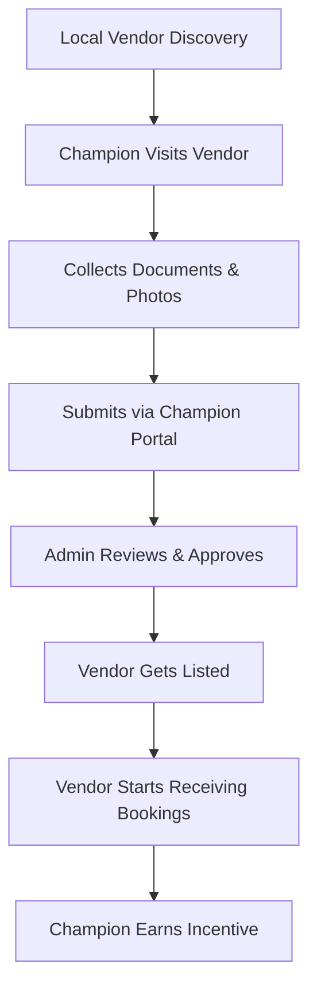

Absolutely. The **Local Champion Program** is a strategic feature that empowers **trusted individuals or small businesses in key regions** to serve as **AfriXport ambassadors and operational partners**. They act as **boots-on-the-ground agents** who onboard, verify, and support service vendors (like tailors, architects, repair techs, etc.) across different cities, states, or countries.

This program builds **trust, accessibility, and quality assurance** into the service platform — especially crucial in Africa and other emerging markets where digital trust is still growing.

---

## 🧱 **1. What is a Local Champion?**

A Local Champion is a vetted and trained **AfriXport affiliate/partner** who is responsible for:

* **Sourcing and onboarding local service providers**
* **Verifying identity, business legitimacy, and service quality**
* Providing **hands-on support and onboarding** (forms, photos, training)
* Serving as a **liaison** between vendors and AfriXport central ops
* **Earning commissions** or bonuses per vendor or service transaction

---

## 🔧 **2. Functional Implementation Overview**

Here’s how the Local Champion Program works in practice:

### A. **Champion Roles & Permissions**

Define a new role:

* Role: `"local_champion"`
* Permissions:

  * Add/edit vendor profile
  * Upload verification documents/photos
  * Approve/reject vendor onboarding requests in region
  * View onboarding progress dashboard

### B. **Champion Portal Features**

Build a simple web dashboard (or mobile-first app) for champions:

| Section                      | Features                                                             |
| ---------------------------- | -------------------------------------------------------------------- |
| 📋 **Onboarding Queue**      | List of vendors in process                                           |
| ✅ **Verify Vendor**          | Upload docs, take geo-tagged photos, fill checklist                  |
| 🧾 **Form Upload**           | ID, CAC/business license, proof of service                           |
| 📊 **Performance Dashboard** | Track how many vendors onboarded, job completion rate, quality score |
| 💬 **Support Chat**          | Contact admin, report fraud, troubleshoot onboarding                 |
| 💰 **Payout Module**         | View commission earned per vendor onboarded or per booking enabled   |

---

## 📲 **3. Vendor Onboarding Workflow (Champion-Led)**



---

## 🔐 **4. Verification Checklist for Champions**

Every vendor a Local Champion onboards must pass a checklist like:

* ✅ Physical location verified
* ✅ ID or CAC certificate uploaded
* ✅ Photos/videos of past work
* ✅ Mobile number verified via OTP
* ✅ WhatsApp/phone working
* ✅ Language & communication check
* ✅ Sample quote/test job (optional)

---

## 🛠️ **5. Technical Implementation Details**

### A. **Database Models**

```sql
-- Local Champion table
CREATE TABLE local_champions (
    id UUID PRIMARY KEY,
    user_id UUID REFERENCES users(id),
    region TEXT,
    status TEXT CHECK (status IN ('active', 'suspended')),
    onboarding_count INT DEFAULT 0,
    rating NUMERIC DEFAULT 5.0
);

-- Vendor Onboarding request
CREATE TABLE vendor_onboard_requests (
    id UUID PRIMARY KEY,
    vendor_name TEXT,
    documents JSONB,
    photos JSONB,
    submitted_by UUID REFERENCES local_champions(id),
    status TEXT CHECK (status IN ('pending', 'approved', 'rejected')),
    verified_at TIMESTAMP
);
```

### B. **Champion Portal (UI Tech Stack)**

* **Frontend**: React.js, Tailwind CSS (or use Retool/Glide for MVP)
* **Backend**: Node.js or Spring Boot
* **Storage**: AWS S3 or Supabase for document/photo uploads
* **Auth**: Supabase Auth or Firebase with role-based access
* **Geo-tagging**: Mobile GPS capture from browser or camera metadata
* **Notifications**: Admin alerts on new vendor submissions

---

## 💸 **6. Incentives & Scaling the Program**

### 🪙 Commission Structure Ideas

| Milestone                                      | Reward               |
| ---------------------------------------------- | -------------------- |
| Vendor verified & listed                       | \$2–\$5              |
| First job completed                            | \$3–\$10 bonus       |
| Monthly active vendor threshold (e.g., 10+)    | Bonus payout         |
| Champion referral (recruiting other champions) | \$5–\$10 per recruit |

### 🧬 Scaling Strategy

* Pilot in 3–5 urban centers (e.g., Lagos, Nairobi, Accra, Abidjan, Johannesburg)
* Recruit champions via churches, tech hubs, SME centers
* Use WhatsApp and local agents to market champion role
* Train champions virtually using onboarding LMS modules (PDF + YouTube)
* Quarterly performance reviews

---

## 🔐 **7. Trust, Fraud Prevention & Quality Control**

* GPS-check uploaded photos to verify local presence
* Random audit of vendors by central team
* Champion rating system (based on vendor performance)
* Penalties for fraud or repeated low-quality onboarding

---

## 🎯 Business Benefits

| Benefit                          | Description                                                 |
| -------------------------------- | ----------------------------------------------------------- |
| 🔎 Regional Growth               | Fast expansion into underserved towns, suburbs, rural areas |
| 🛡️ Trust & Verification         | Reduces risk for buyers with high-quality service vetting   |
| 🧑🏽‍🤝‍🧑🏿 Community Inclusion | Empowers local employment and participation                 |
| 💸 Cost Efficient                | More affordable than hiring full-time field reps            |
| 🔄 Feedback Loop                 | Local champions relay insights back to HQ                   |

---

## ✅ Want Next?

I can help you with:

* A full **Champion Portal UI layout**
* A sample **Champion Onboarding Guide PDF**
* A **No-code MVP version** using Glide or Retool
* A **smart contract escrow integration** for champion payouts

Which one should we build next?
