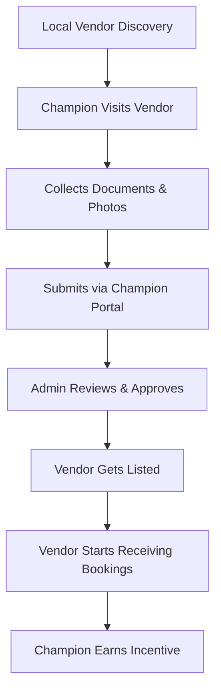

Great expansion! What you're describing now evolves AfriXport from just a **B2B export marketplace** into a **full multi-service digital platform** that includes **local and global professional services** like construction, tailoring, and IT support.

To help you structure and integrate these broader service types, here’s a **framework**, **category list**, and a **feature integration plan**.

---

## 🧩 Categories of Services to Include in AfriXport

| **Category**                             | **Example Services**                                                              |
| ---------------------------------------- | --------------------------------------------------------------------------------- |
| **1. Construction & Real Estate**        | Architecture, building design, construction, carpentry, home repairs, landscaping |
| **2. Manufacturing & Custom Production** | Tailoring, garment production, furniture building, metal works                    |
| **3. Logistics & Warehousing**           | Warehouse space rental, inventory management, last-mile delivery                  |
| **4. Technology Services**               | Computer repairs, software installation, website development, POS setup           |
| **5. Professional Services**             | Legal advisory, accounting, tax services, consulting, translation                 |
| **6. Agricultural Services**             | Tractor rental, irrigation installation, agri-consulting, farm labor              |
| **7. Education & Training**              | Vocational training, business coaching, tech bootcamps                            |
| **8. Health & Wellness**                 | Mobile clinics, diagnostics, wellness advisory                                    |
| **9. Maintenance & Repair**              | Electrical, plumbing, welding, AC repairs                                         |
| **10. Creative & Media**                 | Photography, graphic design, printing, video production                           |

---

## 🔧 Feature Integrations to Enable These Services

### ✅ 1. **Service Listings**

* Service category > Subcategory > Individual service
* Geo-location support (country, city, radius-based filters)
* Searchable with filters (price, delivery time, rating)

### ✅ 2. **Vendor Profile & Verification**

* Each service provider has a profile (portfolio, licenses, reviews)
* Verified status (ID, CAC cert, reviews, insurance)

### ✅ 3. **Booking Engine**

* Calendar integration for appointments
* One-time vs recurring services
* Payment gateway with escrow option
* Chat system with service provider before/after booking

### ✅ 4. **Quoting System**

* Instant quote or “Request for Quote (RFQ)”
* Auto-pricing logic for standard services
* Chat-to-negotiate for custom services

### ✅ 5. **Admin Panel for Service Management**

* Approve or suspend listings
* Dispute resolution dashboard
* Vendor onboarding workflow

### ✅ 6. **Review, Rating, and Dispute System**

* Post-job rating and feedback
* Dispute flag with evidence upload

---

## 🗺️ Suggested Roadmap: Services Expansion in AfriXport

### **🧱 Phase 1: Core Service Infrastructure (0–3 months)**

* Set up modular service listing structure (category > subcategory > service)
* Create service provider profiles
* Enable booking and inquiry for basic services
* Implement payment + escrow integration
* Add review and rating system

### **🚧 Phase 2: Vendor Portal + Scheduling (3–6 months)**

* Vendor can manage bookings (calendar, availability)
* Add pricing logic (flat rate vs per hour/item)
* Launch request-for-quote flow
* Enable document upload (floor plans, designs, etc.)

### **📦 Phase 3: Warehouse & Logistic Services (6–9 months)**

* Real-time availability of warehouse spaces
* Map-based logistics request matching
* Inventory tagging and API integration

### **🌍 Phase 4: Hyperlocal + Export Integration (9–12 months)**

* Geo-targeting for local on-ground services (e.g., "find tailors in Lagos")
* Sync export-oriented services (e.g., freight forwarding, export inspection)
* Service bundling with marketplace products (e.g., buy fabric + book a tailor)

---

## 🧠 Backend Requirements

| **Component**                | **Purpose**                                    |
| ---------------------------- | ---------------------------------------------- |
| Service Catalog DB           | Maintain service types, descriptions, SKUs     |
| User Role Management         | Separate logic for vendors, buyers, admins     |
| Service Booking Engine       | Tracks availability, job status, payment flow  |
| Messaging System (Chat)      | Communication between buyer & service provider |
| Escrow/Smart Contract Module | Protect payments until service is delivered    |
| Geo-location API             | Match services to user locations               |
| Rating/Review Engine         | Build reputation for service providers         |
| Vendor Dashboard Frontend    | Manage service listings, bookings, payments    |

---

## ✨ Example Use Case: Tailoring Service

> A fashion designer in Accra offers custom suits.

1. **Creates Profile** – uploads portfolio, pricing, measurement form
2. **User Books Service** – fills out a form, uploads fabric selection
3. **Booking Confirmed** – designer gets paid after delivery
4. **User Leaves Review** – 5 stars, uploads final look image

---

## 💡 Bonus Ideas to Differentiate AfriXport’s Services

* **Service Bundles**: Offer bundled services (e.g., warehouse + local delivery + export clearing)
* **Mobile-first Booking**: Optimized for WhatsApp, SMS, and voice
* **Local Champion Program**: Regional agents who onboard and verify service vendors
* **AI Matchmaker**: Suggest service providers based on job type, location, and urgency

---

Would you like me to generate **a sample service provider profile UI** or **JSON/DB schema design** for these services next?
---
Absolutely. Let’s break down how this works **technically**, **functionally**, and **from a user journey perspective**, so you can clearly see how to incorporate these **services as a feature** within the AfriXport application.

---

## 🧠 1. **Concept: How "Services" Work in AfriXport**

AfriXport evolves into **a hybrid marketplace**:

* **Products marketplace** (Buy & export goods)
* **Services marketplace** (Book services locally or remotely)

You are now enabling **businesses or professionals** to *offer services*, and **clients** to *search, compare, book, and pay* for those services — like **Uber for tailors**, **Fiverr for construction**, or **Upwork for warehouse managers**, all within AfriXport.

---

## 🔄 2. **User Flow: End-to-End Interaction**

### 👤 A. **Service Provider Workflow**

1. **Registration** – They sign up as a “Service Vendor”
2. **Profile Setup** – Upload service description, portfolio, pricing, availability
3. **Verification** – Upload licenses/ID, reviewed by AfriXport
4. **Service Listing** – Published on platform under relevant category
5. **Receive Booking Requests** – Via platform with chat option
6. **Complete Job** – Upload confirmation (photo/receipt/feedback)
7. **Get Paid** – Payment released from escrow

### 🛒 B. **Client/Buyer Workflow**

1. **Browse/Search Services** – Filter by category, price, reviews, location
2. **View Service Details** – Read profile, see examples, read reviews
3. **Book or Request Quote** – Choose time/date or describe custom job
4. **Pay Securely** – Full or partial via escrow
5. **Track Progress** – Communicate via in-app messaging
6. **Confirm & Review** – Confirm service completion and rate provider

---

## 🏗️ 3. **Core Features & How They Work**

### 🔍 A. Service Search & Discovery

* UI lists services like categories:
  *\[e.g., Tailoring → Custom Suit Design → Top Tailors in Nairobi]*
* Filters: Price, Delivery Time, Location, Verified Vendors
* SEO + tags help discovery

### 📄 B. Service Listing Page

* Components:

  * Photos/Video
  * Description of Service
  * Time Estimates
  * Pricing logic: fixed/hourly/project
  * Service coverage area (local/remote)

### 🧾 C. Booking & Quoting System

* **Book Now**: For fixed-price services
* **Request Quote**: For complex/custom jobs
* Forms collect:

  * Job details
  * Attachments (floorplans, photos, sketches)
  * Location
  * Delivery timeline
* Auto-generate quote or send to vendor for manual quote

### 💳 D. Payment & Escrow

* Escrow wallet logic:

  * User pays in advance
  * AfriXport holds funds
  * Vendor paid after confirmation
* Integration with:

  * Stripe, Flutterwave, Paystack, M-Pesa, MTN MoMo

### 📆 E. Scheduling & Delivery

* Calendar system for service provider availability
* Clients choose appointment slots
* Vendor can update ETA
* Option for recurring bookings

### 📨 F. Messaging & Notifications

* In-app chat per service request
* WhatsApp or email fallback
* Push notifications for:

  * Booking status
  * New messages
  * Review requests

---

## ⚙️ 4. **Architecture Overview (Simplified)**

```
+-------------------+         +----------------------+
|   User Interface  | <-----> |  Service API Gateway |
+-------------------+         +----------------------+
                                  |
                                  |
        +-------------------------+-------------------------+
        |            |               |              |        |
+--------------+ +-------------+ +-----------+ +----------+ |
| Booking DB   | | Vendor DB   | | Payment DB| | Chat DB  | |
+--------------+ +-------------+ +-----------+ +----------+ |
        |                                                  |
        +----------------- Admin Dashboard ----------------+
```

* Microservices or modular APIs manage:

  * Booking
  * Vendors
  * Reviews
  * Payments
  * Notifications
* REST APIs or GraphQL to frontend (web + mobile)

---

## 🧰 5. **Tech Stack Recommendations**

| Layer        | Tool / Technology                               |
| ------------ | ----------------------------------------------- |
| Frontend     | React (Web), React Native (Mobile), Tailwind UI |
| Backend      | Node.js, Spring Boot, or Django                 |
| DB           | PostgreSQL or MongoDB (depending on structure)  |
| Auth         | JWT, OAuth2, Supabase Auth, or Firebase Auth    |
| Payments     | Stripe, Paystack, Flutterwave, M-Pesa           |
| Escrow       | Internal wallet ledger, payout APIs             |
| Messaging    | Socket.IO, Firebase Messaging, Twilio Chat      |
| File Storage | AWS S3, Supabase Storage                        |
| Geo-location | Google Maps API, OpenStreetMap, GeoDB           |
| Admin Panel  | React Admin, Hasura Console, or custom CMS      |

---

## 🔮 6. **Future Expansion Opportunities**

| Feature                      | Value Added                              |
| ---------------------------- | ---------------------------------------- |
| AI-powered Vendor Matching   | Recommends the best vendor for a task    |
| Performance Scorecard        | Ranks vendors by job success & feedback  |
| Mobile App with Offline Mode | Ideal for rural service providers        |
| Franchise/Agent Network      | Grow service footprint by local partners |
| White-label Service Booking  | Let partners embed booking via API       |

---

## 🧪 Want to See an Example?

Let me know and I can:

* Generate a **sample JSON data model** for service listings
* Mock up a **UI/UX wireframe**
* Provide **PostgreSQL schema design**
* Show how to build **booking confirmation API**

Would you like any of those next?

---
Absolutely. The **Local Champion Program** is a strategic feature that empowers **trusted individuals or small businesses in key regions** to serve as **AfriXport ambassadors and operational partners**. They act as **boots-on-the-ground agents** who onboard, verify, and support service vendors (like tailors, architects, repair techs, etc.) across different cities, states, or countries.

This program builds **trust, accessibility, and quality assurance** into the service platform — especially crucial in Africa and other emerging markets where digital trust is still growing.

---

## 🧱 **1. What is a Local Champion?**

A Local Champion is a vetted and trained **AfriXport affiliate/partner** who is responsible for:

* **Sourcing and onboarding local service providers**
* **Verifying identity, business legitimacy, and service quality**
* Providing **hands-on support and onboarding** (forms, photos, training)
* Serving as a **liaison** between vendors and AfriXport central ops
* **Earning commissions** or bonuses per vendor or service transaction

---

## 🔧 **2. Functional Implementation Overview**

Here’s how the Local Champion Program works in practice:

### A. **Champion Roles & Permissions**

Define a new role:

* Role: `"local_champion"`
* Permissions:

  * Add/edit vendor profile
  * Upload verification documents/photos
  * Approve/reject vendor onboarding requests in region
  * View onboarding progress dashboard

### B. **Champion Portal Features**

Build a simple web dashboard (or mobile-first app) for champions:

| Section                      | Features                                                             |
| ---------------------------- | -------------------------------------------------------------------- |
| 📋 **Onboarding Queue**      | List of vendors in process                                           |
| ✅ **Verify Vendor**          | Upload docs, take geo-tagged photos, fill checklist                  |
| 🧾 **Form Upload**           | ID, CAC/business license, proof of service                           |
| 📊 **Performance Dashboard** | Track how many vendors onboarded, job completion rate, quality score |
| 💬 **Support Chat**          | Contact admin, report fraud, troubleshoot onboarding                 |
| 💰 **Payout Module**         | View commission earned per vendor onboarded or per booking enabled   |

---

## 📲 **3. Vendor Onboarding Workflow (Champion-Led)**



---

## 🔐 **4. Verification Checklist for Champions**

Every vendor a Local Champion onboards must pass a checklist like:

* ✅ Physical location verified
* ✅ ID or CAC certificate uploaded
* ✅ Photos/videos of past work
* ✅ Mobile number verified via OTP
* ✅ WhatsApp/phone working
* ✅ Language & communication check
* ✅ Sample quote/test job (optional)

---

## 🛠️ **5. Technical Implementation Details**

### A. **Database Models**

```sql
-- Local Champion table
CREATE TABLE local_champions (
    id UUID PRIMARY KEY,
    user_id UUID REFERENCES users(id),
    region TEXT,
    status TEXT CHECK (status IN ('active', 'suspended')),
    onboarding_count INT DEFAULT 0,
    rating NUMERIC DEFAULT 5.0
);

-- Vendor Onboarding request
CREATE TABLE vendor_onboard_requests (
    id UUID PRIMARY KEY,
    vendor_name TEXT,
    documents JSONB,
    photos JSONB,
    submitted_by UUID REFERENCES local_champions(id),
    status TEXT CHECK (status IN ('pending', 'approved', 'rejected')),
    verified_at TIMESTAMP
);
```

### B. **Champion Portal (UI Tech Stack)**

* **Frontend**: React.js, Tailwind CSS (or use Retool/Glide for MVP)
* **Backend**: Node.js or Spring Boot
* **Storage**: AWS S3 or Supabase for document/photo uploads
* **Auth**: Supabase Auth or Firebase with role-based access
* **Geo-tagging**: Mobile GPS capture from browser or camera metadata
* **Notifications**: Admin alerts on new vendor submissions

---

## 💸 **6. Incentives & Scaling the Program**

### 🪙 Commission Structure Ideas

| Milestone                                      | Reward               |
| ---------------------------------------------- | -------------------- |
| Vendor verified & listed                       | \$2–\$5              |
| First job completed                            | \$3–\$10 bonus       |
| Monthly active vendor threshold (e.g., 10+)    | Bonus payout         |
| Champion referral (recruiting other champions) | \$5–\$10 per recruit |

### 🧬 Scaling Strategy

* Pilot in 3–5 urban centers (e.g., Lagos, Nairobi, Accra, Abidjan, Johannesburg)
* Recruit champions via churches, tech hubs, SME centers
* Use WhatsApp and local agents to market champion role
* Train champions virtually using onboarding LMS modules (PDF + YouTube)
* Quarterly performance reviews

---

## 🔐 **7. Trust, Fraud Prevention & Quality Control**

* GPS-check uploaded photos to verify local presence
* Random audit of vendors by central team
* Champion rating system (based on vendor performance)
* Penalties for fraud or repeated low-quality onboarding

---

## 🎯 Business Benefits

| Benefit                          | Description                                                 |
| -------------------------------- | ----------------------------------------------------------- |
| 🔎 Regional Growth               | Fast expansion into underserved towns, suburbs, rural areas |
| 🛡️ Trust & Verification         | Reduces risk for buyers with high-quality service vetting   |
| 🧑🏽‍🤝‍🧑🏿 Community Inclusion | Empowers local employment and participation                 |
| 💸 Cost Efficient                | More affordable than hiring full-time field reps            |
| 🔄 Feedback Loop                 | Local champions relay insights back to HQ                   |

---

## ✅ Want Next?

I can help you with:

* A full **Champion Portal UI layout**
* A sample **Champion Onboarding Guide PDF**
* A **No-code MVP version** using Glide or Retool
* A **smart contract escrow integration** for champion payouts

Which one should we build next?
