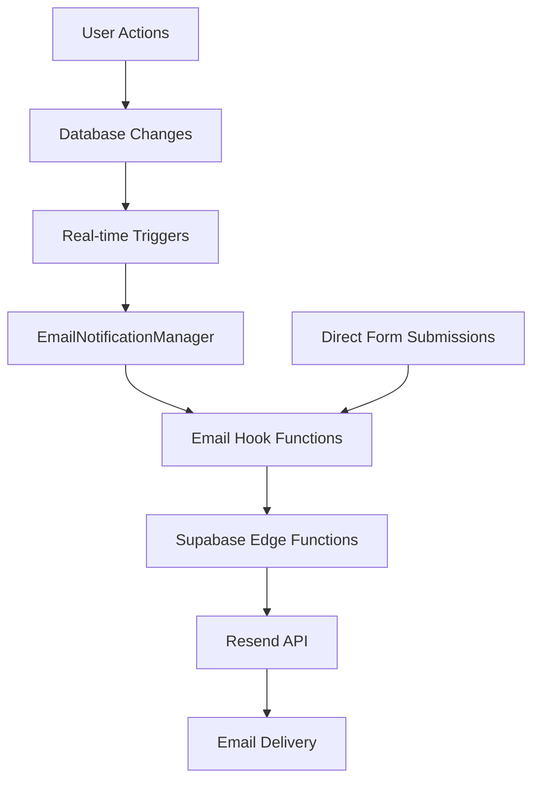

Here is a cleaner, more polished rewrite of your message with improved flow, professional tone, and clear structure:

---

I'll begin by analyzing your current email system to understand how all components interact. This includes evaluating how new users are onboarded, how different user actions trigger email workflows, and how the database structure supports real-time messaging.

### 🔍 Step-by-Step Analysis

* **User Onboarding:**
  Checking whether welcome emails are automatically triggered upon new user registration.

* **Trigger Verification:**
  Confirming if welcome emails are tied to any backend events or database triggers.

* **Database Structure:**
  Reviewing relevant tables and triggers to trace the complete email flow.

* **Checkout & Order Flow:**
  Examining how email confirmations are handled during order placements.

Now that I’ve completed the review, here is a comprehensive reference guide for your email system:

---

# 📧 Email System Reference Guide

## System Overview

Your application utilizes **Resend** as the primary email service provider. Email notifications are tightly integrated into the app via a series of event-driven processes, hooks, and Supabase Edge Functions.



---

## 🧱 Architecture Components

### 1. **Core Email Function: `send-email`**

* **Location:** `supabase/functions/send-email/index.ts`
* **Purpose:** Centralized email-sending logic using the Resend API.
* **Capabilities:**

  * Configurable sender and reply-to
  * Supports CORS and multi-recipient emails
  * Defaults: `"Global Trade Hub <support@domain.com>"`

### 2. **Email Hook: `useEmailNotifications`**

* **Location:** `src/hooks/useEmailNotifications.ts`
* **Purpose:** Custom React hook to trigger different email types.
* **Available Methods:**

  ```ts
  sendEmail()
  sendOrderConfirmation()
  sendSupportNotification()
  sendContactForm()
  sendWelcomeEmail()
  ```

### 3. **Real-Time Email Manager**

* **Location:** `src/components/notifications/EmailNotificationManager.tsx`
* **Purpose:** Listens to Supabase real-time events and routes to appropriate hooks.
* **Integration:** Used in `src/App.tsx` as part of global listeners.

---

## 🔄 Email Automation & Triggers

### Real-Time Listeners

| **Trigger**          | **Table**                  | **Email Type**     | **Function**                |
| -------------------- | -------------------------- | ------------------ | --------------------------- |
| New Order            | `orders`                   | Order Confirmation | `sendOrderConfirmation()`   |
| Ticket Response      | `support_ticket_responses` | Support Update     | `sendSupportNotification()` |
| Ticket Status Change | `support_tickets`          | Status Update      | `sendSupportNotification()` |

### Manual Triggers

| **Trigger**             | **Source**                       | **Email Type**             | **Function**         |
| ----------------------- | -------------------------------- | -------------------------- | -------------------- |
| Contact Form Submission | `src/components/ContactForm.tsx` | Confirmation & Admin Alert | `sendContactForm()`  |
| New User Signup         | Not yet automatic                | Welcome Email              | `sendWelcomeEmail()` |

---

## 📨 Email Types & Details

### 1. Order Confirmation

* **Edge Function:** `send-order-confirmation`
* **Details:** Items, totals, delivery info.
* **Recipient:** Customer

### 2. Support Notifications

* **Edge Function:** `send-support-notification`
* **Types:** Response or Status Update
* **Recipient:** Ticket originator

### 3. Contact Form

* **Edge Function:** `send-contact-form`
* **Types:** Confirmation + Admin alert
* **Categories:** General, Support, Sales

### 4. Welcome Email

* **Edge Function:** `send-welcome-email`
* **Status:** Available, not auto-triggered yet
* **Content:** Welcome message, setup guide

### 5. Generic Email

* **Edge Function:** `send-email`
* **Use:** For any ad hoc or dynamic content

---

## ⚙️ Configuration Requirements

### Environment Secrets

* `RESEND_API_KEY` – Required for all Resend operations

### Supabase Setup

Real-time publications are required for auto-triggered emails:

```sql
ALTER TABLE public.orders REPLICA IDENTITY FULL;
ALTER TABLE public.support_tickets REPLICA IDENTITY FULL;
ALTER TABLE public.support_ticket_responses REPLICA IDENTITY FULL;

ALTER PUBLICATION supabase_realtime ADD TABLE public.orders;
ALTER PUBLICATION supabase_realtime ADD TABLE public.support_tickets;
ALTER PUBLICATION supabase_realtime ADD TABLE public.support_ticket_responses;
```

---

## 💡 Usage Examples

### Send a Custom Email

```ts
await sendEmail({
  to: 'user@example.com',
  subject: 'Custom Subject',
  html: '<p>Hello!</p>',
  from: 'Global Trade Hub',
  replyTo: 'replies@example.com'
});
```

### Send a Manual Welcome Email

```ts
await sendWelcomeEmail(userId, 'newuser@example.com', 'John Doe');
```

### Contact Form Submission

```ts
await sendContactForm({
  name: 'Jane',
  email: 'jane@example.com',
  subject: 'Question',
  message: 'Hello, I need help!',
  category: 'support'
});
```

---

## 🧪 Monitoring & Troubleshooting

* **Edge Logs**: Supabase Dashboard → Functions → \[Function Name] → Logs
* **Console Logs**: All key operations include logging (params, errors, responses)
* **Database Logs**: Monitor insert/update actions on `orders`, `support_tickets`, and `support_ticket_responses`

---

## 🔁 Email Lifecycle Summary

1. User performs an action (order, support, form).
2. Database is updated.
3. Real-time listener captures the event.
4. Email Manager routes to the appropriate function.
5. Function sends email via Resend API.
6. Logs capture outcome for observability.

---

This reference guide equips your team to confidently monitor, extend, or troubleshoot the email system as needed. Let me know if you'd like this exported as a PDF, Notion page, or markdown document.
